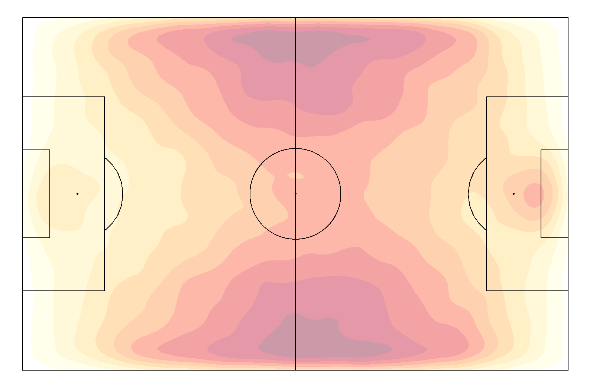
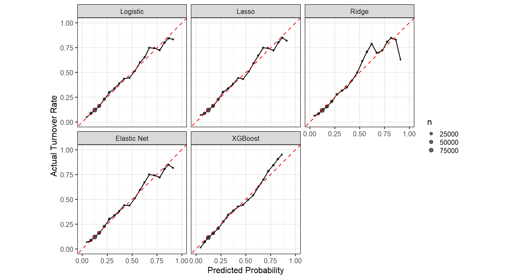
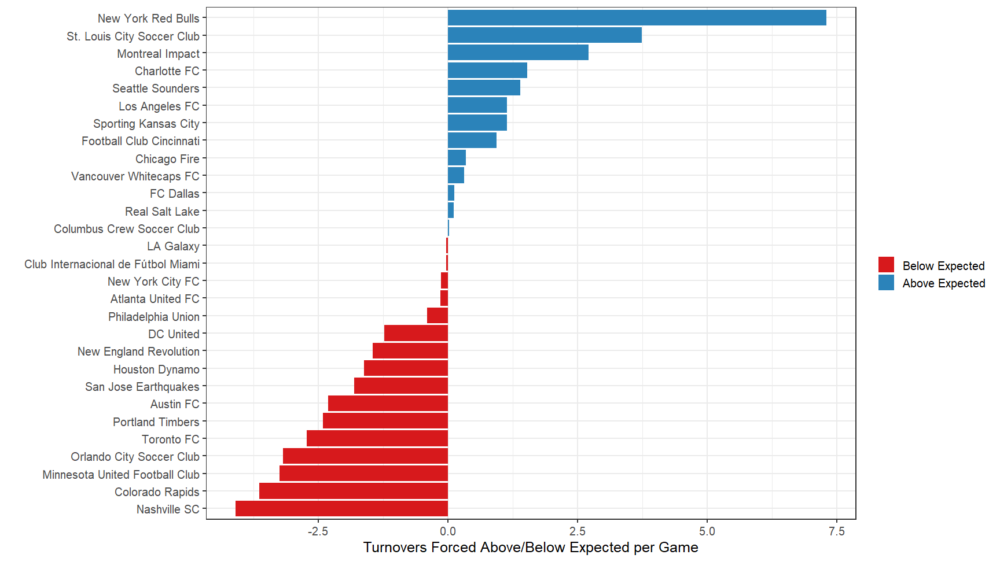
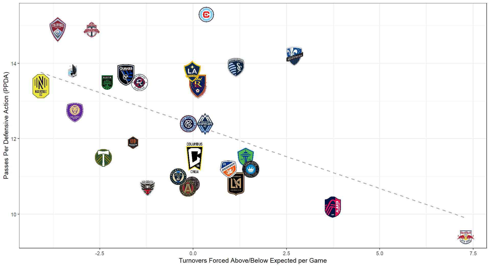

------------------------------------------------------------------------

```{r}
library(tidyverse)
library(data.table)
```

## Introduction

Soccer is a highly tactical sport where defensive tactics not only prevent the opposing team from scoring but can create immediate attacking opportunities. Pressing, a defensive tactic where opposing players apply coordinated pressure on the offensive ball carrier to force turnovers, has been at the core of elite teams like Liverpool under Jürgen Klopp and Manchester City under Pep Guardiola (commonly known as “gegenpressing”). They have shown that effective pressing can turn defense into goal-scoring opportunities within seconds.

This study centers around the question: Can the effectiveness of a press in soccer be predicted using spatial context, pressing dynamics, game context, and situational factors? We have defined our measure of effectiveness as forcing a turnover within 5 seconds of pressing initiation.

## Data

Match information, dynamic events, and player tracking data are provided by SkillCorner. They use artificial intelligence and deep learning to detect moving objects in broadcast videos and extract data. Match information includes the date and time of the games, home and away team names, pitch dimensions, referee information, and other game-level details. Dynamic events include on-ball and off-ball activities such as passes, shots, tackles, recoveries, off-ball runs, goals, and many others. Each event also has a timestamp, location coordinates, and player identification. Player tracking data includes the identities, locations, and movements of all 22 players and the ball throughout the full 90 minutes at a rate of 10 frames per second (10 Hz). Since this data is extracted from broadcast video, SkillCorner uses its technology to extrapolate the coordinates of players outside of the camera’s field of view.

The dataset contains 520 matches played in the 2023 season of Major League Soccer (MLS), the professional soccer league in North America. The dynamic events for 18 of the 520 matches were not provided by SkillCorner because they did not pass their quality check and were, therefore, unusable for this analysis.

## Methods

##### <u>Data processing</u>

Using the player tracking data, we calculated the frame-by-frame distance, velocity, acceleration, and direction of both the players and the ball. These velocities were smoothed using a rolling function with a window size of 3 frames, and the accelerations with a window size of 5 frames. Afterwards, we removed the physically impossible values, such as velocity values larger than 11.9 m/s and acceleration values larger than 10 m/s^2^. We also standardized the data such that the home team always attacks from left to right ([Anzer et al. (2025)](http://arxiv.org/abs/2505.15820)).

##### <u>Detecting pressing actions with player tracking data</u>

While StatsBomb-360 data and possibly other soccer tracking providers tag a pressure or pressing event, SkillCorner does not. To identify pressing events, we initially defined the “pressure zone” as any area within 6 meters of the ball carrier. However, according to [Andrienko et al. (2017)](https://doi.org/10.1007/s10618-017-0513-2), this approach is too simplistic and does not account for the directions players are facing or moving towards. So, we chose to adopt the new approach they had proposed, where the “pressure zone” is elliptical (or oval) rather than circular. The distance limits are determined by the following formula:

$$
L = D_{back} + (D_{front} - D_{back})(z^3 + 0.3z) / 1.3 
$$ where:

$L$ = the maximum distance limit for effective pressure at angle $\theta$ (the radius of the oval-shaped pressure zone at any given angle)

$D_{back}$ = the maximum distance limit when the presser is positioned behind the ball carrier

$D_{front}$ = the maximum distance limit when the presser is positioned in front of the ball carrier

$z$ = $(1 - cos \theta) / 2$

$\theta$ = the angle between the vector from the ball carrier to the center of the attacking goal (which we determined as the threat direction) and the vector from the ball carrier to the presser

Andrienko et al. (2017) determined the distance thresholds $D_{back}$ and $D_{front}$ to be 3m and 9m, respectively, based on consultation with football (soccer) experts. He later performed an experiment to verify these parameters.

```{r pressure-zone-plot}
#| label: fig-pressure-zone-plot
#| fig-cap: "The pressure zone. Left panel shows our initial circular pressure zone approach. Right panel shows the oval pressure zone method from Andrienko et al. (2017), which accounts for directional threat. The shaded blue area is where defending players would be considered as applying pressure to the ball carrier."
#| fig-width: 14
#| fig-height: 6
#| fig.align: "center"


library(ggtext)
library(ggforce)
library(patchwork)

Dfront <- 9
Dback <- 3
n_points <- 360

# Create oval coordinates
angles <- seq(0, 2*pi, length.out = n_points)
formula_angles <- angles + pi
z <- (1 - cos(formula_angles)) / 2
L <- Dback + (Dfront - Dback) * (z^3 + 0.3 * z) / 1.3
x <- L * cos(angles)
y <- L * sin(angles)

oval_coords <- data.table(x = x, y = y)

oval_plot <- ggplot() +
  geom_polygon(data = oval_coords, aes(x = x, y = y), 
               fill = "lightblue", alpha = 0.3, color = "blue", linewidth = 1) +
  geom_point(aes(x = 0, y = 0), color = "red", size = 4) +
  geom_richtext(aes(x = 0, y = 0.5), 
                label = "Pressure target<br>(ball carrier)", 
                color = "red", size = 3.5, fontface = "bold", 
                fill = NA, label.color = NA, vjust = 0) +
  geom_segment(aes(x = 0, y = 0, xend = 12, yend = 0), 
               arrow = arrow(length = unit(0.3, "cm")), 
               color = "darkgreen", linewidth = 1.2) +
  geom_text(aes(x = 12, y = 1), label = "To Goal", hjust = 1, size = 4, color = "darkgreen") +
  geom_segment(aes(x = 0, y = 0, xend = 9, yend = 0), color = "orange", linetype = "dashed", linewidth = 0.8) +
  geom_segment(aes(x = 0, y = 0, xend = -3, yend = 0), color = "purple", linetype = "dashed", linewidth = 0.8) +
  coord_equal() +
  xlim(-10, 12) +
  ylim(-7, 7) +
  labs(x = "Distance (m)", y = NULL) +
  theme_bw()


circle_plot <- ggplot() +
  geom_circle(aes(x0 = 0, y0 = 0, r = 6), fill = "lightblue", alpha = 0.3, color = "blue", linewidth = 1) +
  geom_point(aes(x = 0, y = 0), color = "red", size = 4) +
  geom_richtext(aes(x = 0, y = 0.5), 
                label = "Pressure target<br>(ball carrier)", 
                color = "red", size = 3.5, fontface = "bold", 
                fill = NA, label.color = NA, vjust = 0) +
  geom_segment(aes(x = 0, y = 0, xend = 12, yend = 0), 
               arrow = arrow(length = unit(0.3, "cm")), 
               color = "darkgreen", linewidth = 1.2) +
  geom_text(aes(x = 12, y = 1), label = "To Goal", hjust = 1, size = 4, color = "darkgreen") +
  coord_equal() +
  xlim(-10, 12) +
  ylim(-7, 7) +
  labs(x = "Distance (m)", y = "Distance (m)") +
  theme_bw()


circle_plot + oval_plot + plot_layout(ncol = 2)
```

Now that we have determined the pressure zone, the only other criterion we specified was that the approach velocity of the defender to the ball carrier must be greater than 1 m/s, as proposed by [Merckx et al](https://people.cs.kuleuven.be/~pieter.robberechts/repo/merckx-mlsa21-pressing.pdf). This approach velocity threshold has been set in place to filter out “static” defending/pressing, as the defender must actively engage or move towards the ball carrier even if within the pressure zone. To reiterate, a defending player was classified as "pressing" if they were simultaneously within the oval pressure zone and approaching the ball carrier above the velocity threshold.

##### <u>Grouping pressing actions into sequences</u>

Individual pressing actions were grouped into pressing sequences based on how close they happened in time. We defined a pressing sequence as a continuous period where at least one defender from the same team maintained pressing behavior, allowing for brief interruptions of up to 1.5 seconds (15 frames). In other words, if a pressing defender leaves the pressure zone or is no longer actively pressing, but another defender exhibits pressing behavior within 1.5 seconds, the sequence remains active. However, if the next press begins more than 1.5 seconds after the previous press, a new pressing sequence begins.

For each identified sequence, we extracted the sequence duration (in frames and seconds), the number of defending players involved, and the average approach velocity of pressing defenders at the sequence start. 252,646 pressing sequences were identified.

```{r heatmap}
#| label: fig-heatmap
#| fig-cap: "Heatmap showing the pressing patterns across the MLS 2023 season. The highest concentration of pressing occurs in the middle third of the field on both sides, where teams look to win the ball back in midfield areas to create quick attacking opportunities. Note: the home team is made to always attack left-to-right, the away team goes right-to-left."
#| out-width: "80%"
#| fig.align: "center"


```

##### <u>Measuring an effective press</u>

Since the goal of pressing is to regain ball possession or force a turnover by the attacking team, [Lee et al. (2025)](https://cdn.prod.website-files.com/5f1af76ed86d6771ad48324b/67c11b74f20ffc6e0d19bd7b_exPress_MITSloan_Final.pdf) highlighted that the impact of pressing should extend beyond immediate ball possession. This is mainly because pressing can force the attacking team into tight positions, which may increase the likelihood of an eventual turnover in the next few seconds or actions. They tested different success criteria for pressing, such as regaining possession after 7 seconds or after 4 actions, among others, but their analysis focused on regaining possession within 5 seconds of the pressing initiation. As a result, we decided to use the same method and assess the effectiveness of a pressing sequence based on whether the pressing team forced a turnover within 5 seconds of the start of the pressing sequence.

##### <u>Feature engineering</u>

After data cleaning and processing, we had 31 features that were used for training our model. These included:

-   Spatial Context: Ball carrier position, distance to boundaries, field third, etc.
-   Pressing Dynamics: Number of defenders, approach velocity, passing options, etc.
-   Game Context: Score, game state (winning/losing/drawing), time remaining, etc.
-   Situational Factors: How the ball carrier gained possession (pass reception, interception, etc.), incoming pass characteristics (distance, height, range), etc.

These features were extracted from already tagged events provided by SkillCorner and from processing the player tracking data.

## Results

##### <u>Model Performance</u>

We compared five models to predict forced turnovers within 5 seconds of pressing initiation: logistic regression (as a baseline), Lasso, Ridge, Elastic Net, and XGBoost. All models were evaluated using 10-fold cross-validation with match-based splits to prevent data leakage. To reduce computational load, hyperparameter tuning was done on a 50% stratified sample of the data to find the best XGBoost parameters.

XGBoost achieved the best performance with the lowest log loss (0.434) and highest F1 score (0.519). Logistic regression, Lasso, and Elastic Net produced nearly identical results, with log loss values around 0.445 and accuracy of 82.2%. Ridge regression performed slightly worse with a log loss of 0.448. The class imbalance in our dataset (23% turnovers vs. 77% no turnovers) is evident in the high accuracy scores across all models but low recall values around 0.39-0.40, indicating that models are better at predicting unsuccessful presses than successful ones.

```{r model-summary}
#| label: tbl-model-summary
#| tbl-cap: "Model Performance Summary"
#| out-width: "80%"
#| fig.align: "center"

knitr::include_graphics("Visualizations/model_summary.png")
```

At first glance, the performance difference between XGBoost and logistic regression appears negligible. To determine whether this difference is statistically meaningful, we compared the log loss of the two models using a z-score test:

$$
|z| = \frac{|\bar{x}_{xgboost} - \bar{x}_{logit}|}{\sqrt{SE^2_{xgboost} + SE^2_{logit}}}
$$

$$
= \frac{|0.434 - 0.445|}{\sqrt{0.00263^2 + 0.00255^2}}
$$

$$
= \frac{0.011}{0.00366}
$$

$$
= 3.02
$$

XGBoost's average log loss is lower than logistic regression's by approximately 0.011, which is 3.02 standard errors apart. This implies a statistically significant difference in performance between the two models.

While logistic regression offers greater interpretability and simplicity, XGBoost's statistically significant improvement and ability to capture complex non-linear relationships make it the preferred choice for generating our pressing effectiveness metrics. We use XGBoost for all subsequent team-level analyses.

##### <u>Model Calibration</u>

Figure 3 shows calibration plots for all five models. Logistic regression, Lasso, and Elastic Net show nearly identical calibration patterns, while XGBoost demonstrates less fluctuation and smoother calibration across the probability range.

```{r calibration-plot}
#| label: fig-calibration-plot
#| fig-cap: "Calibration plot"
#| out-width: "100%"
#| fig.align: "center"


```

## Use-Case

This use-case shows how our pressing model evaluates team performance using out-of-sample predictions. Ideally, we would train on one season and test on another (e.g., train on 2023, test on 2024). Since we only have the 2023 MLS season, we use 10-fold cross-validation stratified at the game level as a proxy. This means each game's expected turnover probability (xP) came from a model never trained on that game's data, ensuring our team performance metrics reflect genuine out-of-sample predictions rather than in-sample fitted values.

##### <u>Team Pressing Performance Rankings</u>

The New York Red Bulls were the most effective pressing team, forcing more than 7 more turnovers per game than predicted, followed behind by St. Louis City SC in their inaugural season. Nashville SC had the worst record.

```{r diverge-plot}
#| label: fig-diverge-plot
#| fig-cap: "Positive values (blue) indicate teams forcing more turnovers than predicted, while negative values (red) show underperformance. New York Red Bulls led MLS in pressing effectiveness, while Nashville SC struggled most relative to expectations."
#| out-width: "100%"
#| fig.align: "center"


```

##### <u>Comparing our model to Passes Per Defensive Action (PPDA)</u>

[Opta Analyst](https://theanalyst.com/articles/mls-stats-2023) defines PPDA, a common metric used to evaluate pressing in soccer, as the number of opposition passes allowed outside of the pressing team's own defensive third, divided by the number of defensive actions by the pressing team outside of their own defensive third. A lower figure indicates a higher level of pressing, while a higher figure indicates a lower level of pressing.

We compared our model results with PPDA values reported by [Opta](https://theanalyst.com/articles/mls-stats-2023) for the 2023 MLS season. While these metrics measure pressing differently (PPDA focuses only on defensive actions outside the pressing team's defensive third, while our model evaluates pressing across the entire pitch), Figure 5 shows a clear relationship between the two metrics.

Teams with lower PPDA values (more aggressive pressing) tend to force more turnovers above expectation, while teams with higher PPDA values force fewer. This negative correlation suggests our pressing effectiveness metric captures similar underlying pressing behaviors as PPDA, while providing additional context about which teams convert their pressing intensity into actual turnovers.

```{r PPDA}
#| label: fig-PPDA
#| fig-cap: "Relationship between PPDA and pressing effectiveness for MLS teams in 2023. The negative correlation indicates that teams pressing more aggressively (lower PPDA) tend to force more turnovers than expected."
#| out-width: "100%"
#| fig.align: "center"


```

##### <u>When pressing vs. when being pressed</u>

*Figure 6* shows the relationship between pressing effectiveness and press resistance, measured as the difference between actual and expected turnovers per game (`xP_diff`). When pressing, positive `xP_diff` values indicate forcing more turnovers than expected. When being pressed, negative `xP_diff` values indicate better press resistance. For visualization, the y-axis was inverted so higher values represent better performance on both axes.

Sporting Kansas City, Real Salt Lake, and Vancouver Whitecaps FC excel at both pressing and press resistance (upper-right quadrant). St. Louis City Soccer Club and New York Red Bulls show strong pressing but are vulnerable when being pressed (lower-right). Portland Timbers struggle at both.

```{r pressing-pressed}
#| label: fig-pressing-pressed
#| fig-cap: "Pressing effectiveness versus press resistance for MLS teams during the 2023 season."
#| out-width: "100%"
#| fig.align: "center"

knitr::include_graphics("Visualizations/pressing_vs_pressed_plot.png")
```

## Discussion

##### <u>Feature Importance</u>

Variable importance analysis showed that `start_type` contributed approximately 70% of total model importance. This variable describes how the ball carrier gained possession of the ball, which could be an interception, reception, recovery, etc. When we looked at the actual turnovers, pressing sequences where the ball carrier gained possession from an interception led to a high turnover rate, approximately 74% of the time (*Table 2*). This aligns with tactical principles employed at the highest levels of professional football. As Domenec Torrent, Pep Guardiola's former assistant coach at Manchester City, explained: "When we lose the ball it's very important for Pep to press high in five seconds. If you don't win it back within five seconds then make a foul and go back" (Torrent, cited in [Manchester Evening News](https://www.manchestereveningnews.co.uk/sport/football/football-news/man-city-rule-champions-torrent-14978819)). This immediate pressing approach, particularly effective when opponents have just gained possession through interceptions, reflects the vulnerability window that our data quantifies, demonstrating why `start_type` is an important predictor of successful pressure outcomes.

```{r turnover-rate}
#| label: tbl-turnover-rate
#| tbl-cap: "Turnover rates by how ball carrier gained possession. Interceptions show vulnerability to immediate pressing."
#| out-width: "60%"
#| fig.align: "center"

knitr::include_graphics("Visualizations/turnover_start_type.png")
```

##### <u>Limitations</u>

-   Class imbalance in the dataset (23% turnovers vs. 77% no turnovers) led to models with high accuracy but lower recall for the minority class.

-   XGBoost tuning was performed on a 50% sample of the data. We tested incremental samples (10%, 20%, 30%, then 50%) and observed performance improvements with each increase, suggesting the model would perform even better if tuned on the entire dataset.

-   Our analysis uses only MLS data, limiting generalizability to other leagues with different tactical styles, player quality, or physical demands. We had access to NWSL 2023 season data but decided against training on MLS and testing on NWSL, as these two leagues vary greatly.

-   Grouping pressing actions into sequences means this approach cannot evaluate individual player pressing effectiveness, as multiple defenders can contribute to a single pressing sequence.

- Missing values were flagged with indicator variables (for numeric features) or labeled as 'unknown' (for categorical features) rather than estimated, which may limit the model's ability to capture underlying patterns.

##### <u>Future</u>

-   Incorporating the pressing intensity calculation proposed by [Andrienko et al., 2017](https://doi.org/10.1007/s10618-017-0513-2) and pitch control models to account for spatial dominance.

-   Sensitivity analysis on the 5-second window for pressing effectiveness by testing alternative time thresholds (e.g., 3 seconds, 4 seconds, 6 seconds).

-   More research on the shape and boundaries of the pressure zone and whether they’re different for each team or player position categories.

## Acknowledgement

Special thanks to Daniel Wicker (Charlotte FC), Dr. Ron Yurko, Quang Nguyen, the CMSACamp TAs, and Carnegie Mellon University.

## Citations

Andrienko, G., Andrienko, N., Budziak, G., Dykes, J., Fuchs, G., von Landesberger, T., & Weber, H. (2017). Visual analysis of pressure in football. Data Mining and Knowledge Discovery, 31(6), 1793–1839. <https://doi.org/10.1007/s10618-017-0513-2>

Anzer, G., Arnsmeyer, K., Bauer, P., Bekkers, J., Brefeld, U., Davis, J., Evans, N., Kempe, M., Robertson, S. J., Smith, J. W., & Van Haaren, J. (2025). Common Data Format (CDF): A Standardized Format for Match-Data in Football (Soccer). <http://arxiv.org/abs/2505.15820>

Bauer, P., & Anzer, G. (2021). Data-driven detection of counterpressing in professional football: A supervised machine learning task based on synchronized positional and event data with expert-based feature extraction. Data Mining and Knowledge Discovery, 35. <https://doi.org/10.1007/s10618-021-00763-7>

Lee, M., Jo, G., Hong, M., Bauer, P., & Ko, S.-K. (2025). exPress: Contextual Valuation of Individual Players Within Pressing Situations in Soccer.

Merckx, S., Robberechts, P., Euvrard, Y., & Davis, J. (n.d.). Measuring the Effectiveness of Pressing in Soccer. Robberechts, P. (n.d.). Valuing the Art of Pressing.

## Contact Information

David Almona, Centre College, [almonadavid\@gmail.com](almonadavid@gmail.com)

Natalie Rayce, Carnegie Mellon University, [nrayce\@andrew.cmu.edu](nrayce@andrew.cmu.edu)

## Code Availability

Code available on [GitHub](https://github.com/almonadavid/CMU-Soccer-SkillCorner.git)
