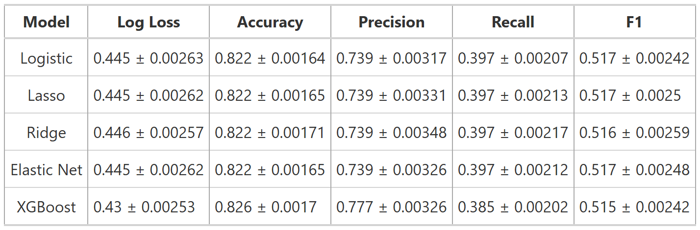
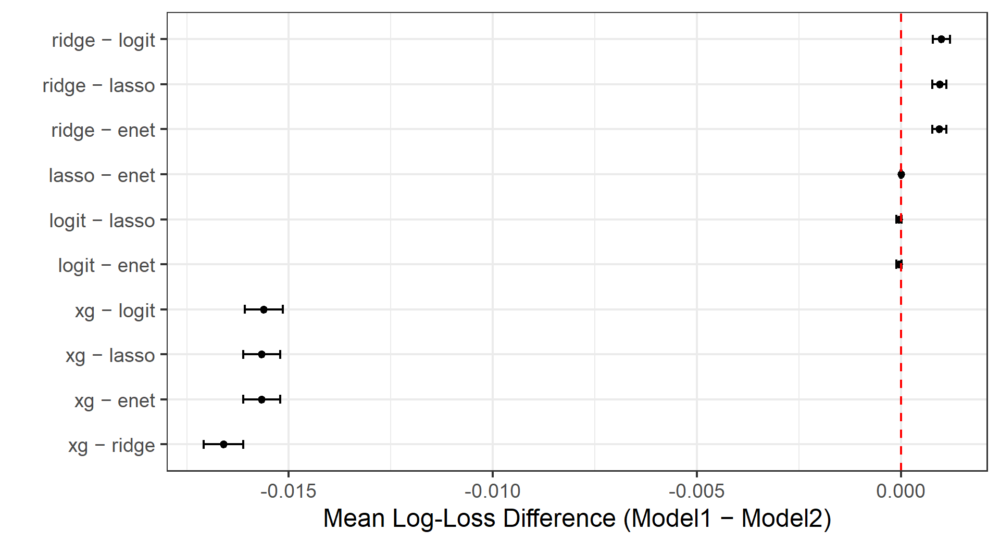
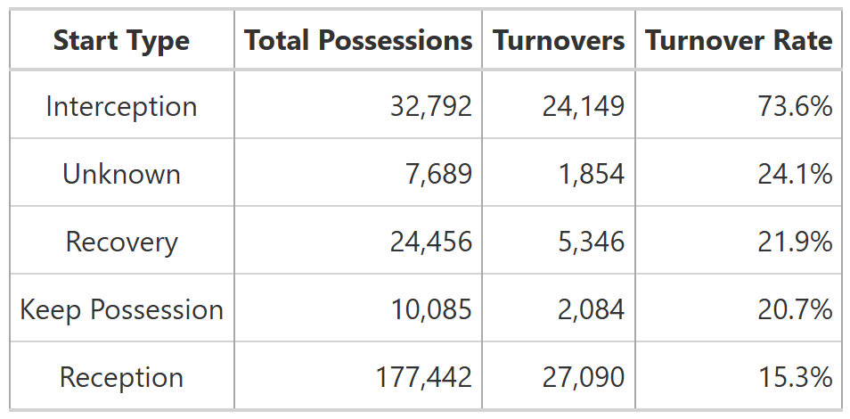
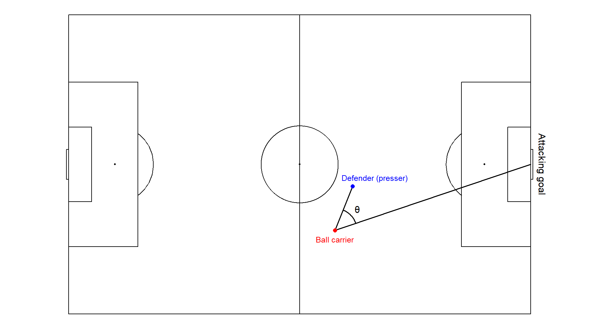
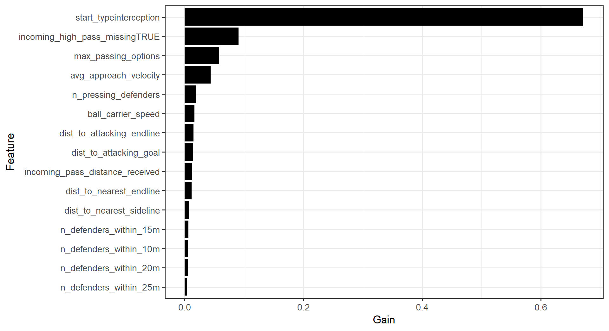
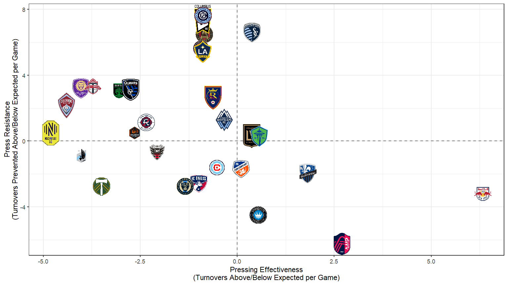

# Key Terms

**Pressing:** a defensive tactic where players apply coordinated pressure on the opponent with the ball to force mistakes, win back possession, and quickly transition to attack <br> <br> **Forced Turnover:** when a player loses possession due to opponent pressure, resulting in the opposing team gaining control. This includes misplaced passes, interceptions, successful tackles, or losing control under pressure - all direct results of effective defensive pressure

## Turning Defense to Attack

::: video

:::

Manchester City wins back possession seconds after losing it through pressing.

# Data

-   **Source:** SkillCorner

-   **Dataset:**

    -   520 matches in the MLS 2023 season
    -   18 unusable matches with no event data

-   **Three data types:**

    -   **Match information:** game details (teams, pitch, referee)
    -   **Event data:** player actions (passes, shots, tackles) with timestamps and coordinates
    -   **Tracking data:** real-time positions of all players and ball at 10 Hz

# Steps

<br> 1. Identify when a press occurs using player tracking data

<br> 2. Define the criteria for an effective press

<br> 3. Modeling & Results

## Initial Pressure Zone

-   Within **6 meters** of the ball carrier

```{r cirle-plot}
#| fig-width: 16
#| fig-asp: 0.6
#| fig-align: center

library(ggtext)
library(ggforce)
library(patchwork)

circle_plot <- ggplot() +
  geom_circle(aes(x0 = 0, y0 = 0, r = 6), 
              fill = "lightblue", alpha = 0.3, color = "blue", linewidth = 1) +
  geom_point(aes(x = 0, y = 0), color = "red", size = 4) +
  geom_richtext(aes(x = 0, y = 0.5), 
                label = "Pressure target<br>(ball carrier)", 
                color = "red", size = 8, fontface = "bold", 
                fill = NA, label.color = NA, vjust = 0) +
  geom_segment(aes(x = 0, y = 0, xend = 12, yend = 0), 
               arrow = arrow(length = unit(0.3, "cm")), 
               color = "darkgreen", linewidth = 1.2) +
  geom_text(aes(x = 12, y = 1), label = "To Goal", hjust = 1, size = 8, color = "darkgreen") +
  coord_equal() +
  xlim(-10, 12) +
  ylim(-7, 7) +
  labs(x = "Distance (m)", y = "Distance (m)") +
  theme_bw() +
  theme(axis.title = element_text(size = 20))

circle_plot
```

**Problem:** Doesn't account for direction and oversimplifies pressing

## The Pressure Zone

Adopted from Andrienko et al. (2017).[^1]

[^1]: *Visual analysis of pressure in football* (https://doi.org/10.1007/s10618-017-0513-2)

```{r oval-plot}
#| fig-width: 12
#| fig-asp: 0.5
#| fig-align: center

library(ggtext)
library(ggforce)
library(patchwork)
library(data.table)

Dfront <- 9
Dback <- 3
n_points <- 360

# Create oval coordinates
angles <- seq(0, 2*pi, length.out = n_points)
formula_angles <- angles + pi
z <- (1 - cos(formula_angles)) / 2
L <- Dback + (Dfront - Dback) * (z^3 + 0.3 * z) / 1.3
x <- L * cos(angles)
y <- L * sin(angles)

oval_coords <- data.table(x = x, y = y)

oval_plot <- ggplot() +
  geom_polygon(data = oval_coords, aes(x = x, y = y), 
               fill = "lightblue", alpha = 0.3, color = "blue", linewidth = 1) +
  geom_point(aes(x = 0, y = 0), color = "red", size = 4) +
  geom_richtext(aes(x = 0, y = 0.5), 
                label = "Pressure target<br>(ball carrier)", 
                color = "red", size = 4, fontface = "bold", 
                fill = NA, label.color = NA, vjust = 0) +
  geom_segment(aes(x = 0, y = 0, xend = 12, yend = 0), 
               arrow = arrow(length = unit(0.3, "cm")), 
               color = "darkgreen", linewidth = 1.2) +
  geom_text(aes(x = 12, y = 1), label = "To Goal", hjust = 1, size = 4, color = "darkgreen") +
  geom_segment(aes(x = 0, y = 0, xend = 9, yend = 0), color = "orange", linetype = "dashed", linewidth = 0.8) +
  geom_segment(aes(x = 0, y = 0, xend = -3, yend = 0), color = "purple", linetype = "dashed", linewidth = 0.8) +
  coord_equal() +
  xlim(-10, 12) +
  ylim(-7, 7) +
  labs(x = "Distance (m)", y = "Distance (m)") +
  theme_bw() +
  theme(axis.title = element_text(size = 12))

oval_plot
```

# Pressing Criteria

A defending player was classified as "pressing" if they were simultaneously

-   within the oval pressure zone, *AND*
-   approaching the ball carrier above a velocity threshold of 1 m/s.

::: fragment
Pressing actions were grouped into sequences if at least one defender continued pressing within 1.5 seconds.

**252,464 pressing sequences** were identified across the 502 MLS matches.
:::

## But What Makes An Effective Press?

::: fragment
-   Since the goal of pressing is to regain ball possession from the attacking team, the impact of pressing should extend beyond immediate ball re-possession.

-   Pressing can force the attacking team into tight positions, which may increase the likelihood of an eventual turnover in the next few seconds or actions.
:::

::: fragment
A press is effective when there's **a forced turnover within 5s of pressing initiation.**<br>
:::

::: fragment
<br> **Features**: 31 features were extracted and used for training our model:

-   **Spatial Context**: Ball carrier position, distance to boundaries, field third, etc.

-   **Pressing Dynamics**: Number of defenders, approach velocity, passing options, etc.

-   **Game Context**: Score, game state (winning/losing/drawing), time remaining, etc.

-   **Situational Factors**: How the ball carrier gained possession (pass reception, interception, etc.), incoming pass characteristics (distance, height, range), etc.
:::

## Modeling

We compared five models all evaluated using 10-fold cross-validation with match-based splits to prevent data leakage. <br><br> Hyperparameter tuning was done on a 50% stratified sample of the data to find the best XGBoost parameters.

::: fragment
```{r model-summary}
#| out-width: "100%"


```

<p style="margin-top: 15px; text-align: left;">
  <span style="font-size: 18px;">
    *Calibration plots are available in the appendix.*
  </span>
</p>

:::

## Do the Models Perform the Same?
Paired t-tests show XGBoost achieves significantly lower log loss than logistic regression.

```{r paired-ttest}
#| fig-width: 20
#| fig-align: center


```

<p style="margin-top: 15px; text-align: left;">
  <span style="font-size: 18px;">
    *Interpretation: Mean differences below 0 indicate Model1 achieves lower log loss; mean differences above 0 indicate Model2 achieves lower log loss. Confidence intervals crossing 0 indicate not statistically different.*
  </span>
</p>

## New York Red Bulls pressed best

```{r div-plot}
#| out-width: "100%"

knitr::include_graphics("diverging_plot.png")
```

## Comparing our model to PPDA

**What's Passes Per Defensive Action (PPDA)?:** the number of opposition passes allowed outside of the pressing team’s own defensive third, divided by the number of defensive actions by the pressing team outside of their own defensive third. <br><br> A lower figure indicates a higher level of pressing, while a higher figure indicates a lower level of pressing. <br><br>

::: fragment
**In short:**

-   PPDA measures <u>pressing aggressiveness</u>

-   Our model measures <u>pressing effectiveness</u>
:::

::: fragment
<p>**So why even compare these?**</p>
:::

## Lower PPDA Correlates with More Turnovers Forced

```{r ppda-plot}
#| fig.align: "center"
#| out-width: "110%"

knitr::include_graphics("ppda_plot.png")
```

<p style="margin-top: 15px; text-align: left;">
  <span style="font-size: 18px;">
    *PPDA values from [Opta Analyst](https://theanalyst.com/articles/mls-stats-2023).*
  </span>
</p>

## Variable Importance

-   The feature `start_type` contributed approximately **70% of total model importance**.

-   This describes **how the ball carrier got in possession** of the ball.

::: fragment
-   In the SkillCorner data, there are 14 categorical levels, but we grouped them into 5:

**Reception** ← pass_reception, goal_kick_reception, throw_in_reception, corner_reception, free_kick_reception

**Interception** ← pass_interception, goal_kick_interception, throw_in_interception, corner_interception, free_kick_interception

**Recovery** ← recovery

**Keep Possession** ← keep_possession

**Unknown** ← unknown, missing values
:::

<p style="margin-top: 30px; text-align: left;">
  <span style="font-size: 18px;">
    *Variable importance plot is available in the appendix.*
  </span>
</p>

## 74% of Presses After Interceptions Led to Turnovers

Looking at actual turnovers, pressing the ball carrier when they got the ball from an interception led to a turnover approximately **74%** of the time.

```{r turnover-rate}
#| fig.align: "center"
#| out-width: "100%"


```

# 

**Limitations**

-   **Class imbalance** in the dataset (23% turnovers vs. 77% no turnovers) led to models with high accuracy but lower recall for the minority class.

-   **MLS-only data** limits generalizability to leagues with different physical demands and player quality.

-   Grouping pressing actions into sequences means this approach **cannot evaluate individual player** pressing effectiveness

-   **Missing values** were flagged or labeled as 'unknown' rather than estimated, which may limit the model's ability to capture underlying patterns.

::: fragment
**Future Work**

-   Add pressing intensity calculations and pitch control models.

-   Sensitivity analysis on the 5-second window for pressing effectiveness by testing alternative time thresholds (e.g., 3 seconds, 4 seconds, 6 seconds).

-   More research on the shape and boundaries of the pressure zone.
:::

# 

::::: columns
::: {.column width="60%"}
**Acknowledgement:** SkillCorner, Daniel Wicker (Charlotte FC), Dr. Ron Yurko, Quang Nguyen, the CMSACamp TAs, and Carnegie Mellon University - Statistics & Data Science <br><br>

**Contact Information:**

-   David Almona: [almonadavid.github.io](https://almonadavid.github.io/)

-   Natalie Rayce: [linkedin.com/in/natalie-rayce-318a70283](https://www.linkedin.com/in/natalie-rayce-318a70283/)
:::

::: {.column width="40%"}
{width="100%"}
:::
:::::

# Thank You

# Appendix

## A.1: Oval Pressure Zone Formula

$$
L = D_{back} + (D_{front} - D_{back})(z^3 + 0.3z) / 1.3 
$$ where:

-   $L$ = the maximum distance limit for effective pressure at angle $\theta$

-   $D_{back}$ = the max. distance limit when the presser is positioned behind the ball carrier

-   $D_{front}$ = the max. distance limit when the presser is positioned in front of the ball carrier

-   $z$ = $(1 - cos \theta) / 2$

-   $\theta$ = the angle between the vector from the ball carrier to the center of the attacking goal (our threat direction) and the vector from the ball carrier to the presser

Andrienko et al. (2017) determined the distance thresholds $D_{back}$ and $D_{front}$ to be **3m** and **9m**, respectively, based on consultation with football (soccer) experts. He later performed an experiment to verify these parameters.

## A.2: The pressure zone angle

```{r pressure-angle}
#| out-width: "100%"


```

## A.3: Feature Descriptions {.scrollable}

```{r feature-table}
#| echo: false
library(knitr)

features <- data.frame(
  Feature = c("ball_carrier_x", "ball_carrier_y", "n_pressing_defenders", 
              "max_passing_options", "avg_approach_velocity", "poss_third_start",
              "game_state", "start_type", "incoming_high_pass", 
              "incoming_pass_distance_received", "incoming_pass_range_received",
              "organised_defense", "dist_to_nearest_sideline", "dist_to_nearest_endline",
              "dist_to_attacking_endline", "dist_to_defensive_endline", 
              "dist_to_attacking_goal", "minutes_remaining_half",
              "minutes_remaining_game", "ball_carrier_direction", "ball_carrier_speed",
              "penalty_area", "n_defenders_within_10m", "n_defenders_within_15m",
              "n_defenders_within_20m", "n_defenders_within_25m"),
  
  Description = c("x-coordinate of ball carrier at press start", 
                  "y-coordinate of ball carrier at press start",
                  "Number of unique defenders who were actively pressing",
                  "Number of available passing options for ball carrier",
                  "Average speed of pressing defenders (m/s)",
                  "Pitch third where press begins",
                  "Current match status (winning/drawing/losing)",
                  "How player gained possession",
                  "Pass received above 1.8m height",
                  "Distance of received pass (m)",
                  "Range category of received pass",
                  "Defense organized at pass moment",
                  "Distance to nearest sideline (m)",
                  "Distance to nearest endline (m)",
                  "Distance to attacking endline (m)",
                  "Distance to defensive endline (m)",
                  "Distance to attacking goal center (m)",
                  "Minutes left in current half",
                  "Minutes left in match",
                  "Ball carrier direction (degrees)",
                  "Ball carrier speed (m/s)",
                  "Press starts in penalty area",
                  "Defenders within 10m radius",
                  "Defenders within 15m radius",
                  "Defenders within 20m radius",
                  "Defenders within 25m radius"),
  
  Type = c("Numeric", "Numeric", "Numeric", "Numeric", "Numeric", "Categorical",
           "Categorical", "Categorical", "Boolean", "Numeric", "Categorical",
           "Boolean", "Numeric", "Numeric", "Numeric", "Numeric", "Numeric",
           "Numeric", "Numeric", "Numeric", "Numeric", "Boolean", "Numeric",
           "Numeric", "Numeric", "Numeric")
)

kable(features, 
      align = c("l", "l", "c"),
      caption = "Some features used in the model")
```

## A.4: Calibration Plots

```{r calibration-plot}
#| fig.align: "center"
#| out-width: "110%"

knitr::include_graphics("calibration_plot_slides.png")
```

## A.5: Variable Importance Plot

```{r vip-plot}
#| fig.align: "center"
#| out-width: "110%"


```

## A.6: Pressing vs. Being Pressed

```{r pressing-pressed}
#| out-width: "100%"
#| fig.align: "center"


```
